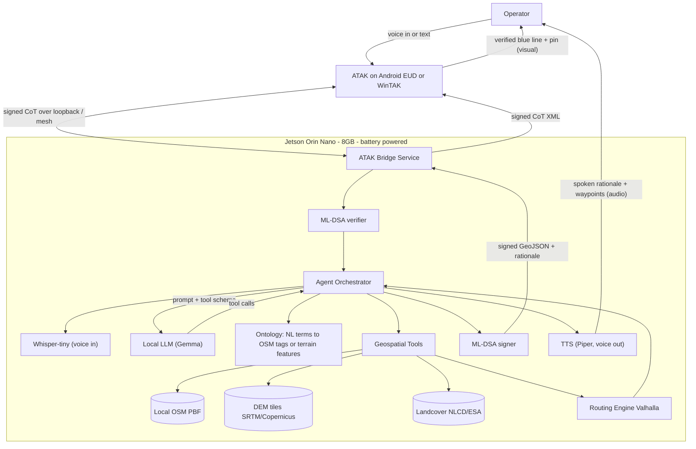

# TERA — Tactical Edge Route Agent
## Product Requirements Document (PRD)
### by Team **TruePoint** · National Security Hackathon 2026

> **Codename wordplay:** *TERA* (the agent) ↔ *terra* (Latin: earth, terrain) ↔ *terraform* (the act of shaping it). The name carries the product thesis: an AI that lets an operator shape their own path across any terrain, anywhere on earth. Use this in the Figma palette: earth-tones, contour-line motifs, terraforming-as-empowerment imagery.

> **Product codename:** **TERA** — Tactical Edge Route Agent (locked pre-kickoff, 2026-05-02 ~11:23).
> **Team name:** **TruePoint** (locked pre-kickoff, 2026-05-02 ~11:10).
> **Status:** v0.7 — Team / product split: **Team TruePoint** ships **TERA**. Multimodal in/out (Whisper + Piper) is core. CesiumJS leading for Phase 1 viz (Cesium Ion via Kyle). Figma owned by Jon. Ben drops Figma; gains scenario-authoring + operator-cadence TTS consult.
> **Owners:** 4-person team (see §13).
> **Last updated:** May 2, 2026 (Hackathon Day 1, pre-kickoff).

---

## 1. Hackathon Anchor


| Field                           | Value                                                                                                                                                                                                                                       |
| ------------------------------- | ------------------------------------------------------------------------------------------------------------------------------------------------------------------------------------------------------------------------------------------- |
| **Event**                       | 3rd Annual National Security Hackathon                                                                                                                                                                                                      |
| **Hosts / Partners**            | Cerebral Valley (host) · US Army xTech (RFI partner) · Stanford Gordian Knot Center · Berkeley Defense Tech Society · Shield Capital (co-host) · IQT, DCVC, Palantir (partners) · OpenAI, Armada, Scale, Deloitte, Tenex, Skyrun (sponsors) |
| **Date / Location**             | May 2 (0900) – May 3 (1600) PDT, San Francisco, in-person only                                                                                                                                                                              |
| **Hard build window**           | Sat **1145** → Sun **1200** (~24h hacking). Submissions due Sun 1200. Finalist demos at 1410. Winners 1515.                                                                                                                                 |
| **Team cap**                    | 4 (we are at cap)                                                                                                                                                                                                                           |
| **Prize**                       | Top 5 teams split **$50,000 cash**, courtesy of the US Army                                                                                                                                                                                 |
| **Primary problem statement**   | **PS2 — Edge Deployments and Drone Operation**                                                                                                                                                                                              |
| **Secondary problem statement** | **PS3 — Mission Command and Control**                                                                                                                                                                                                       |
| **Tertiary alignment**          | **PS4 — Digital Defense and Cybersecurity** (via PQC-signed CoT, see §8)                                                                                                                                                                    |
| **Mandatory rules**             | Public GitHub at submission · new work only (no prior code) · openly accessible tools only · must fit one of 5 problem statements                                                                                                           |


### Why three problem statements

PS2 calls explicitly for "lightweight edge computing architecture capable of running … onboard inference from a portable, battery-powered kit optimized for field conditions" and operating "when connectivity to a central network is intermittent or denied." That is literally our system.

PS3 calls for "natural language querying" of an "operational picture." Our ATAK integration with NL prompts is a direct hit.

PS4 calls for protecting AI deployments and hardening "the digital backbone that modern operations depend on." Our PQC-signed CoT construct (§8) directly defends against TAK track injection — a real, currently-unaddressed vulnerability.

We **lead** the pitch with PS2 (clearest single thesis), use the **mid-demo** beat to show PS3 (NL → ATAK render), and use the **security beat** to claim PS4 (track-injection defense). One continuous demo, three judging hooks.

---

## 2. Executive Summary (the emotional hook)

> A Marine recon team is 36 hours into a patrol in mountainous terrain. Comms are denied. GPS is intermittent. The team's water is gone, and their map doesn't show what's actually walkable above 2,500 meters. The team lead has a Jetson-sized device clipped to their plate carrier, paired to ATAK. They tap the device and say:
>
> *"Plot the fastest covered route to the nearest freshwater within 5km, avoiding ridgelines."*
>
> Twenty seconds later, ATAK draws a blue line down a draw, around a saddle, and into a creek the team had walked past in the dark. No cloud. No external transmissions. No bars on any radio.

This is the product. Everything below exists to make that moment real and defensible.

**One-sentence thesis:** *A pocket-sized, fully-offline AI agent that turns natural language into trustworthy tactical routes inside ATAK, on the edge, in environments where the cloud doesn't exist — and where the network around you can't be trusted either.*

---

## 3. Core Problem

Operators in austere or contested environments need to plan routes under cognitive load with degraded inputs:

1. **Connectivity is denied or untrusted.** Cloud-based map and routing services (Google, Apple, Bing, Mapbox cloud) are unavailable, latent, or actively dangerous to call from an emitting device.
2. **Existing ATAK route plugins assume connectivity** or rely on raster imagery that doesn't encode terrain affordances (cover, slope, water, vegetation density).
3. **Specialist navigation knowledge doesn't scale.** Translating an intent ("covered route", "vehicle-passable", "avoid skyline crossings") into terrain analysis takes a trained NCO and 20+ minutes. We have neither in volume.
4. **The TAK network itself is untrusted.** CoT (Cursor on Target) messages have no built-in authentication. Anyone on the multicast bus can inject false tracks or false routes — which means the cleanest thing you build can be poisoned by the dirtiest device on the mesh.
5. **Cognitive load + time pressure compounds every failure.** Operators are already tracking comms, contact, casualties, and weather. Map analysis is a tax on the wrong cognitive budget.
6. **Dual-use shortfall.** The same gap exists for SAR teams, wildland firefighters, expeditioners, and humanitarian responders in disaster zones.

**The unmet need:** *natural-language → routed-path*, on a battery-powered device, with no outbound packets, with cryptographic provenance on every track that touches the operator's screen, rendered in the C2 stack the operator is already using.

---

## 4. Solution Overview

A natural-language **multimodal** tactical route agent. The operator speaks or types intent; an on-device LLM interprets it as a structured query over local geospatial data; a local routing engine returns a route; the route is signed with post-quantum credentials; ATAK renders it visually **and** an on-device TTS engine speaks the rationale + waypoints aloud — so an operator who is climbing, scanning, or hands-on with another task can navigate by ear without looking at the screen.

```
USER PROMPT (voice OR text)
        │  (Whisper-tiny on Jetson for voice in)
        ▼
LOCAL LLM (Gemma) ──► tool-call: {find_pois | route | terrain_query}
        │
        ▼
GEOSPATIAL TOOLS (local OSM extract + DEM + landcover)
        │
        ▼
ROUTING ENGINE (Valhalla, custom cost model)
        │
        ▼
SIGNING LAYER (ML-DSA / Dilithium signs each CoT field)
        │
        ├─► ATAK RENDERER (CoT over loopback / mesh) ──► verified blue line on screen
        │
        └─► TTS ENGINE (Piper, on-device) ──► spoken rationale + waypoints in operator's ear
```

**Hero claim for the pitch:** *"Voice in, voice and visual out — from spoken intent to ATAK-rendered route plus narrated turn-by-turn in under 30 seconds, with WiFi physically off, every track post-quantum signed."*

**Why multimodal output matters (operator reality):** A Marine fast-roping into an LZ, a SAR team rappelling a cliff face, or a combat engineer running a vehicle while reading a map cannot look at a tablet. Reading text off an ATAK screen requires both eyes and one hand the operator does not have. **Hands-free output is not a nice-to-have — it's the whole reason the system exists when the operator is moving.**

---

## 5. User Personas

### P-1 (Primary): Recon Marine / SOF Team Lead — "Sgt. Vega"

- **Context:** Small team, austere terrain, denied comms, plate-carrier weight budget.
- **Goal:** Move from waypoint A to a goal (water, OP, exfil) along a route that minimizes signature and risk.
- **Pain:** Map analysis under stress; legacy tools require connectivity; specialist terrain reads don't scale.
- **Speaks like:** "covered route", "skyline", "draw", "saddle", "exfil", "PR", "BAMCIS".

### P-2 (Primary): Combat Engineer — "SSgt. Hayes"

- **Context:** Plans vehicle and dismount routes for a unit; worries about slope, surface, bridges, choke points.
- **Goal:** Generate vehicle-passable routes with realistic constraints (vehicle class, max grade, water crossings).
- **Pain:** Existing tools either too crude (straight-line) or too detailed (full GIS workstation).

### P-3 (Secondary, dual-use): SAR Team Lead / Wildland Fire IC / Expedition Leader — "Sam"

- **Context:** Civilian austere environments — search grids in wilderness, fireline planning, mountaineering.
- **Goal:** Same primitives — covered/efficient route, find resource (water, LZ, road), avoid hazard.
- **Why we care:** unlocks the dual-use commercial channel (§10) without changing the product.

### P-4 (Tertiary): Allied / Coalition Operator — "LtCdr. Putra"

- **Context:** Partner-nation operator (e.g., Indonesian Navy littoral team) needs the same capability without ITAR friction or US-cloud dependency.
- **Why we care:** Self-contained edge deploy with optional sovereign data layers is a wedge for FMS/coalition sales.

---

## 6. User Scenarios / Journeys

### 6.1 Dual-modality demo construct

The demo runs in **two AOs back-to-back**, on the same device, same software, same prompt:

1. **Modality 1 — San Francisco (familiar).** Operator prompt references the **Ferry Building** as a known anchor. Judges immediately understand the geometry; we show the system working in territory they walked through this morning.
2. **Modality 2 — austere conflict-zone overlay (mission-real).** Same Jetson, same prompts, real DEM + OSM extract for an active conflict region (final selection at kickoff). We narrate: *"Same software. Same battery. Same operator. Different planet."*

**Why this beats a single-AO demo:** YouTube tactic #1 (emotional) and #6 (focus) both apply. SF gets the head-nod ("I get it"); the flip gets the lean-forward ("oh — this is the actual mission"). The contrast *is* the dual-use story.

### 6.2 Hero scenario (locked at kickoff — see §15)

Three candidate scenarios. The team picks one as THE live demo at the 1145 kickoff vote; the other two stay in the deck as spoken-only proof of generality.

**Scenario A — "Plot a route to the nearest freshwater source" (hands-free demo construct)**

1. Operator opens ATAK on Android EUD; agent app paired to Jetson over USB or BLE. **Operator's eyes are on the terrain, not the screen** — same constraint as a real climbing or fast-roping moment.
2. Operator speaks (push-to-talk, Whisper-tiny on Jetson): *"Route me to the nearest freshwater source within 5km, on foot, covered terrain."*
3. Agent transcribes → parses → `find_pois(type=freshwater, radius=5km, from=current)` → `route(profile=foot_covered, to=top_result)`.
4. Routing engine returns GeoJSON; agent signs each CoT field with ML-DSA; agent posts CoT to ATAK.
5. **Visual channel:** ATAK draws the route + waypoint pin + estimated time.
6. **Audio channel:** TTS speaks through the operator's headset: *"Selected creek two-point-one kilometers northeast. Route follows draw to avoid ridgeline at grid one-two-three-four-five, six-seven-eight-nine-zero. ETA three-eight minutes on foot at four kilometers per hour. First waypoint, two hundred meters bearing zero-three-zero."* The operator never has to look down.
7. (Stretch) Operator hits push-to-talk again: *"Repeat last waypoint."* / *"Distance to objective?"* — agent answers via TTS without re-routing.

**Scenario B — "Plot a covered foot route avoiding ridgelines"**

1. Operator: *"Foot route to grid 11SMS1234 5678, avoid ridgelines, max 35° slope."*
2. Agent parses → `route(profile=foot, avoid=ridgelines, max_slope=35, to=grid)`.
3. Cost model penalizes high-prominence cells (computed from DEM) and slope > threshold.
4. ATAK renders signed route; rationale highlights the two ridgelines bypassed.

**Scenario C — "Vehicle route around impassable terrain"**

1. Operator: *"MRAP-passable route to FOB Bravo, no fords deeper than 0.5m, avoid bridges flagged restricted."*
2. Agent parses → `route(profile=vehicle_mrap, max_ford=0.5m, exclude_tags=[bridge:restricted])`.
3. Routing engine respects vehicle class + tag exclusions.
4. ATAK renders signed route; rationale lists 1 bridge avoided, 1 alternate selected.

**Scenarios deliberately deferred (post-hackathon):** multi-vehicle deconfliction, fire-and-maneuver covered-by-fire route pairs, threat-overlay-aware routing.

Each scenario is mocked in Figma by P4 (YouTube tactic #9).

---

## 7. Technical Architecture

### 7.1 System diagram




### 7.2 Component table


| Layer      | Component              | Choice                                                                                                     | Notes                                                                                                                   |
| ---------- | ---------------------- | ---------------------------------------------------------------------------------------------------------- | ----------------------------------------------------------------------------------------------------------------------- |
| Hardware   | Compute                | **Jetson Orin Nano 8GB**                                                                                   | Brought by P3. Target ~7W idle, ~15W under inference.                                                                   |
| Hardware   | Display                | Small HDMI panel + Android EUD over USB tether                                                             | Demo: hardware display = wow factor (YouTube #7).                                                                       |
| Hardware   | Power                  | USB-C PD battery bank                                                                                      | Demonstrate "WiFi off, on battery" during pitch.                                                                        |
| Hardware   | Mesh (stretch)         | Phone + laptop + Nano on one mesh (WiFi-Direct, BLE, or LoRa)                                              | Substrate for the PQC-signed-CoT demo construct (§12).                                                                  |
| Voice      | STT (voice in)         | **Whisper-tiny** (39M params), CUDA on Jetson                                                              | Push-to-talk button; no always-on listening. Jon (P1) owns.                                                             |
| Voice      | TTS (voice out)        | **Piper** (`rhasspy/piper`), neural, CPU-only, ~30MB voice model                                           | Speaks rationale + waypoints aloud. Hands-free output for moving operator. Alternates: Coqui (heavier), eSpeak (robotic). Pick at Sat 1400. |
| LLM        | Model                  | **Gemma 3n / Gemma 2B** (Q4_K_M quantized)                                                                 | Pick based on JTOP perf measured Sat afternoon.                                                                         |
| LLM        | Runtime                | `llama.cpp` (CUDA) or `ollama`                                                                             | `ollama` faster to bring up; `llama.cpp` more controllable.                                                             |
| LLM        | Tool-calling           | Structured-output prompting + JSON schema validation                                                       | If model supports native tool-calling, use it; else parse-and-validate fallback.                                        |
| Geospatial | Vector data            | **OpenStreetMap PBF**, regional extracts (SF + austere AO)                                                 | Use `osmium` to clip / filter tags.                                                                                     |
| Geospatial | Elevation              | **SRTM 1-arcsec** or **Copernicus GLO-30** DEM tiles                                                       | Pre-load tiles for both demo AOs.                                                                                       |
| Geospatial | Imagery + 3D terrain   | **Cesium Ion** (token via Kyle, P3) — global imagery + Cesium World Terrain                                | Phase 1 web frontend: CesiumJS 3D globe (Jon). Pipeline: pre-cache terrain/imagery tiles for SF + austere AO (Ben). **Online-only — pre-cache before WiFi off; never called in Phase 3 runtime.** |
| Geospatial | Landcover (stretch)    | **ESA WorldCover** or **NLCD**                                                                             | Used for cover/concealment cost.                                                                                        |
| Routing    | Engine                 | **Valhalla** (preferred) or **GraphHopper**                                                                | Both support custom cost models + offline tiles. Valhalla's dynamic costing is a better fit for NL-derived constraints. |
| Routing    | Cost extension         | Custom slope-from-DEM + ridgeline-prominence cost                                                          | P4 owns cost model authoring.                                                                                           |
| Agent      | Orchestrator           | Python + FastAPI                                                                                           | Single process on Jetson; exposes `POST /plan`.                                                                         |
| Agent      | Ontology               | YAML/JSON ontology mapping NL terms → OSM tag predicates + cost params                                     | P1 owns. E.g., `freshwater → natural=spring OR water=stream OR water=river`.                                            |
| Crypto     | Signature scheme       | **ML-DSA (Dilithium)** via `liboqs` Python bindings                                                        | NIST FIPS 204 (Aug 2024). Per-CoT-field signatures.                                                                     |
| Crypto     | Key exchange (stretch) | **ML-KEM (Kyber)** via `liboqs`                                                                            | NIST FIPS 203. For confidential peer comms on the mesh.                                                                 |
| ATAK       | Integration            | **CoT XML over TCP/UDP** + KML fallback                                                                    | Both Android EUD and WinTAK targeted (see below).                                                                       |
| ATAK       | Targets                | **Android EUD primary** (hero shot) + **WinTAK on a laptop** (backup if BLE/USB fails)                     | P3 brings both setups.                                                                                                  |
| ATAK       | Plugin (stretch)       | Native ATAK plugin (Java, Android Studio)                                                                  | Only if mesh stretch is descoped.                                                                                       |
| API        | Surface                | `POST /plan` `{ prompt, lat, lon }` → `{ route_geojson, waypoints, rationale, cost_breakdown, signature }` | Versioned; logged.                                                                                                      |


### 7.3 Phased build & demo-readiness ladder

**Critical scoping decision baked in:** at every checkpoint we have a complete, demo-able product. We never ship "almost working."


| Phase                           | Hardware                            | LLM                               | Network                 | Demo state                                                                                                           | Target time                         |
| ------------------------------- | ----------------------------------- | --------------------------------- | ----------------------- | -------------------------------------------------------------------------------------------------------------------- | ----------------------------------- |
| **P1 — Web MVP**                | Laptop                              | Frontier API (OpenAI / Anthropic) | Online                  | Web app, click point on map, type prompt, see route on Leaflet/MapLibre + ATAK via KML import                        | **Sat 1800**                        |
| **P2 — Edge w/ frontier**       | Jetson + display                    | Frontier API                      | Online (Jetson WiFi)    | Same UX, but running on the device on the table; CoT into ATAK on phone (signed)                                     | **Sun 0200**                        |
| **P3 — Fully local (HERO)**     | Jetson + display                    | **Gemma local**                   | **WiFi physically off** | Pitch demo: airplane mode, route plans, ATAK draws line, voice input, signed CoT                                     | **Sun 1000**                        |
| **Stretch — Mesh + PQC reject** | Jetson + phone + laptop on one mesh | Gemma local                       | Mesh only               | Two-device demo: inject unsigned track from laptop → ATAK rejects. Generate route on Jetson → signed → ATAK accepts. | **Only if Sun 0700 go/no-go is GO** |


If P3 doesn't converge by Sun 1000, **we demo P2 and pitch P3 as the architecture**. We never demo a broken P3.
If the mesh stretch doesn't converge by Sun 1100, **we demo PQC signing on a single device** (sign + verify locally; mesh inject demo cut to a 30-second slide).

---

## 8. Security Considerations — Featured Threat Model

We are submitting to a US-Army-partnered hackathon. Security is the **third judging hook** (PS4) and the centerpiece of the mid-demo beat. This section is written to be excerptable into the pitch deck.

### 8.1 The featured threat: TAK track injection

CoT (Cursor on Target) is the lingua franca of TAK. By default, **CoT messages are unauthenticated.** Anyone on the multicast bus or shared network can inject:

- false enemy tracks
- false friendly tracks
- false routes (including this product's output)

In a contested or coalition environment with mixed-trust devices on the same mesh, this is the unlocked back door of every TAK network. **A clean route from a Marine's Jetson is indistinguishable on the wire from a poisoned route injected by an adversary.**

### 8.2 The mitigation: post-quantum signed CoT

We sign every CoT field at the source with **ML-DSA (Dilithium, NIST FIPS 204, standardized Aug 2024)**.


| Step                         | What                                                                                                                           | Library                          | Owner   |
| ---------------------------- | ------------------------------------------------------------------------------------------------------------------------------ | -------------------------------- | ------- |
| 1. Generate identity keys    | ML-DSA-65 keypair per device, on first boot, stored in `/etc/wayfinder/keys/` (rootfs encrypted)                               | `liboqs-python`                  | P2      |
| 2. Sign on emit              | Agent's signer wraps each CoT field (point, route geometry, waypoint, rationale) with an ML-DSA signature + timestamp + key ID | `liboqs-python`                  | P2 + P4 |
| 3. Verify on ingest          | ATAK Bridge verifier checks signature against trust list before forwarding to ATAK                                             | `liboqs-python`                  | P2 + P4 |
| 4. Trust list                | Static list of allowed key IDs for the demo; in prod, replaced with a CRL / shared root                                        | flat file                        | P2      |
| 5. (Stretch) Encrypt to peer | ML-KEM-768 (Kyber) key exchange + AES-256-GCM payload for unicast peer comms on the mesh                                       | `liboqs-python` + `cryptography` | P2      |


**Why post-quantum and not just ECDSA:** because the pitch is "this is the security architecture for the next 30 years of operations, not a band-aid for the next 3." Army audience knows about CNSA 2.0 and the post-quantum mandate. This lands.

**Why this is feasible in 24 hours:** `liboqs-python` is pip-installable; ML-DSA-65 sign/verify is sub-millisecond on the Jetson; CoT signature attachment is a string concat on emit + a string parse on ingest. The hard part is the trust list semantics, and we keep that trivially flat for the demo.

### 8.3 Full threat model


| Threat                         | Vector                                         | Mitigation in MVP                                                                           | Mitigation post-MVP                              |
| ------------------------------ | ---------------------------------------------- | ------------------------------------------------------------------------------------------- | ------------------------------------------------ |
| **Track injection (FEATURED)** | Unsigned CoT on multicast                      | **ML-DSA-signed CoT, verifier in bridge**                                                   | CRL, key rotation, hardware-rooted identity      |
| Data exfiltration via LLM      | Prompt-injected tool call with outbound URL    | Allow-list of tool names; no `http_get` tool exposed; egress firewall on Jetson             | Sandboxed tool runtime, DNS sinkhole             |
| Model tampering / supply chain | Compromised model weights                      | Pin model by SHA-256; verify on boot                                                        | Sigstore-signed artifacts; reproducible build    |
| Map data poisoning             | Tampered OSM extract                           | Hash-verify PBF on load; ship known-good extracts                                           | Signed map bundles; differential update protocol |
| Adversarial prompt             | "Route through enemy AO and exfil my position" | Prompt is local-only — no network egress to leak it. Tool schema rejects out-of-AO targets. | Policy layer + audit                             |
| ATAK CoT injection             | Malicious CoT into ATAK                        | **See featured mitigation §8.1-8.2**                                                        | mTLS to ATAK; CRL distribution                   |
| Physical compromise            | Jetson lost/captured                           | Encrypt rootfs; no plaintext mission data at rest                                           | Tamper-evident enclosure; remote wipe over LoRa  |
| Side channel                   | Power / thermal during inference               | Out of scope for MVP                                                                        | Constant-rate inference scheduling               |


### 8.4 Demo-time security proof points

These are visible artifacts during the pitch (YouTube tactic #3 — wow factor):

1. `**tcpdump -i any` window** open on a second screen during P3 demo. Shows zero outbound packets while a plan is generated. P2 owns this.
2. **Pre-flight checklist on stage:** WiFi disabled (visible toggle), Bluetooth disabled, ethernet unplugged.
3. `**sha256sum` of model + map data** printed on screen before run; matches a value on a printed card the judge can verify.
4. **Audit log** scrolls in a corner: every prompt, every tool call, every route generated, every signature verified, timestamped.
5. **Signature inject demo (stretch):** laptop on mesh attempts to inject unsigned track → ATAK rejects → Jetson generates signed route → ATAK accepts. Two-device side-by-side. **This is the PS4 wow moment.**

### 8.5 Deferred but documented

- FIPS-validated crypto modules (we use `liboqs`, not a FIPS module — flagged as transition work)
- DoD STIG compliance for the Jetson image
- Cross-domain solutions for multi-classification rendering
- Formal accreditation (ATO) path

These appear in the PRD as a transition roadmap (§10), not as MVP work.

---

## 9. Competitive Landscape & Novelty


| Capability                                   | ATAK Route plugin | ATAK Plan Pilot (cloud LLM) | Gaia GPS / OnX Hunt | Generic edge LLMs (Llamafile, etc.) | **Us**                      |
| -------------------------------------------- | ----------------- | --------------------------- | ------------------- | ----------------------------------- | --------------------------- |
| Natural-language prompt → route              | ✗                 | ✓                           | ✗                   | partial                             | **✓**                       |
| Voice input (offline)                        | ✗                 | ✗                           | ✗                   | ✗                                   | **✓**                       |
| Fully offline (no cloud)                     | ✓ (basic)         | ✗                           | ✓                   | ✓                                   | **✓**                       |
| Terrain-aware cost (slope, cover, ridgeline) | partial           | ✗                           | partial             | ✗                                   | **✓**                       |
| ATAK-native rendering                        | ✓                 | ✓                           | ✗                   | ✗                                   | **✓**                       |
| Edge LLM (no API call)                       | n/a               | ✗                           | n/a                 | ✓                                   | **✓**                       |
| **PQC-signed CoT (track-injection defense)** | ✗                 | ✗                           | n/a                 | ✗                                   | **✓**                       |
| Tactical persona language                    | ✓                 | partial                     | ✗                   | ✗                                   | **✓**                       |
| Open source / openly buildable               | varies            | ✗                           | ✗                   | ✓                                   | **✓** (per hackathon rules) |
| Dual-use civilian path                       | ✗                 | ✗                           | ✓                   | ✗                                   | **✓**                       |


**Novelty claim:** *We are the first open, fully-offline, voice-enabled natural-language route planner that renders directly into ATAK with post-quantum-signed provenance and runs on a single battery-powered Jetson.* Each clause is load-bearing; remove any one and someone else has shipped it.

---

## 10. Business Model & Dual-Use

**Primary channel — DoD/IC:**

- Army xTech follow-on (this hackathon is an RFI).
- AFWERX / SOFWERX SBIR Phase I → II → III pathway.
- OTA via DIU; Tradewind for AI-specific OTAs.
- Direct PEO C3T / PEO IEW&S engagement (ATAK ecosystem owners).
- CNSA 2.0 / post-quantum migration is a tailwind: every C2 tool will need PQC-signed messaging within the decade. We're shipping it now.

**Coalition / FMS:**

- Self-contained edge deploy avoids US cloud dependencies — wedge for partner-nation sales (Indonesian Navy, AUKUS partners). P2 is our SME here.

**Dual-use commercial:**

- **SAR & wildland fire:** Cal Fire, NIFC, county SAR. Same primitives; no ATAK requirement (KML / GeoJSON output).
- **Expeditions / mountaineering:** premium consumer SKU; partnership with Garmin / inReach.
- **Humanitarian / disaster response:** UN OCHA, IFRC; offline routing in disaster zones with destroyed infra.

**Revenue model:** Hardware + software bundle for gov; software-only SaaS-on-edge license for commercial (per-device annual). Open core; proprietary tactical extensions.

**Why we win the dual-use angle:** lowering the barrier to austere navigation has a civilian market that funds the platform and provides talent / data flywheel that DoD-only products can't build.

---

## 11. Success Metrics

### 11.1 Hackathon-scoped (judging fit)

- ✅ Submitted by Sun 1200 with public GitHub.
- ✅ Live demo executes hero scenario end-to-end (voice prompt → ATAK signed route).
- ✅ Pitch hits all 4 judge hooks: emotional hook (§2), live demo wow (§7.3 P3), competitive table (§9), business model (§10).
- ✅ Mapped to PS2 with PS3 + PS4 alignment articulated in pitch.
- ✅ Dual-modality demo (SF → austere) executed without dead air.

### 11.2 Product-scoped (the things we measure on stage)


| Metric                                    | Target                               | How measured                                                                         |
| ----------------------------------------- | ------------------------------------ | ------------------------------------------------------------------------------------ |
| Voice → route latency (Jetson, local LLM) | < 30s p50                            | Wall clock from button release to CoT received in ATAK                               |
| End-to-end prompt → ATAK render           | < 60s p95                            | Same pipeline, including ATAK draw                                                   |
| Whisper-tiny WER on operator vocabulary   | < 10% on 20-prompt eval set          | Jon (P1) owns eval                                                                   |
| TTS first-audio latency (Piper)           | < 1s from `/plan` response → speaker | Jon (P1); measured on Jetson with same headset used in demo                          |
| TTS audio duration for hero rationale     | ~ 6-10s (concise, military cadence)  | Jon (P1); rationale templates phrased for fast clear narration, not prose            |
| Route quality (Marine SME rating)         | ≥ 4 / 5 on hero + secondary scenario | P4 (mountain warfare trained) rates 5 sample routes vs. his hand-planned equivalents |
| Outbound packets in P3 demo               | **0**                                | `tcpdump` capture on stage                                                           |
| LLM tool-call success rate                | ≥ 90% on 20-prompt eval set          | Pre-built eval script (P1 owns)                                                      |
| ML-DSA sign + verify round-trip           | < 5ms per CoT field                  | P2 micro-benchmark                                                                   |
| Unsigned track rejection rate             | 100%                                 | P2 fuzz test in CI                                                                   |
| Power draw under inference                | ≤ 15W                                | `tegrastats` on screen                                                               |


### 11.3 Post-hackathon (north stars)

- ATAK plugin (native) shipped to TAK Product Center for review.
- Pilot deployment with one Marine unit and one SAR team within 90 days.
- Latency parity with frontier-API baseline at 1/10th the energy.
- Trust-list / CRL distribution protocol designed and prototyped.

---

## 12. Demo & Pitch Plan

5-minute structure (final round). Two-presenter format per YouTube tactic #8.


| Time        | Beat                            | Who                            | Notes                                                                                                                                                            |
| ----------- | ------------------------------- | ------------------------------ | ---------------------------------------------------------------------------------------------------------------------------------------------------------------- |
| 0:00 – 0:30 | **Hook**                        | Presenter A                    | Read §2 verbatim. No slides yet.                                                                                                                                 |
| 0:30 – 1:30 | **Problem + persona language**  | Presenter A                    | Establish expertise in first 2 min: "I trained at Marine Corps Mountain Warfare; this is the gap." Use operator vocabulary.                                      |
| 1:30 – 2:15 | **Live demo: SF modality**      | Presenter B drives, A narrates | Voice prompt referencing the **Ferry Building**. ATAK draws signed route. Judges nod.                                                                            |
| 2:15 – 3:00 | **Live demo: austere flip**     | Presenter B drives, A narrates | *"Same software. Same battery. Same operator. Different planet."* Same prompt structure on real DEM of austere AO. ATAK draws signed route. Judges lean forward. |
| 3:00 – 3:30 | **Security beat (PS4)**         | Presenter B                    | If stretch landed: laptop tries to inject unsigned track → ATAK rejects. If not: zoom in on signature in the CoT, narrate.                                       |
| 3:30 – 4:00 | **Wow + offline proof**         | Presenter A                    | Pan to `tcpdump` window: zero packets. Pan to airplane-mode toggle: ON. Hold 2 seconds in silence.                                                               |
| 4:00 – 4:30 | **Novelty + competitive table** | Presenter A                    | Single slide: §9 table. One sentence on each cell.                                                                                                               |
| 4:30 – 4:50 | **Business model + dual-use**   | Presenter A                    | Single slide: §10.                                                                                                                                               |
| 4:50 – 5:00 | **Ask**                         | Presenter A                    | Specific ask: pilot unit + post-hackathon mentorship from Army xTech + intro to TAK Product Center.                                                              |


**Pitch dry-run discipline:**

- Minimum **1.5 hours** of rehearsal Sat night and Sun morning.
- Rehearse exact mouse paths and click sequences.
- Pre-flight checklist (Sun 1340, before finalist demos):
  - Close all browser tabs except those needed.
  - Disable all desktop notifications (macOS Focus / Do Not Disturb).
  - Silence Slack, Signal, iMessage, email.
  - Phone in airplane mode (the Android EUD is the ATAK target, *not* a phone receiving texts).
  - Jetson on battery; WiFi/BT off; status visible to audience.
  - ATAK pre-loaded with both AOs; prior CoT cleared.
  - WinTAK backup laptop running and on the same configuration.
  - Backup: pre-recorded 30s video of hero scenario in case live fails.
  - Two-presenter handoff cues confirmed.
- **No feature dump.** We mention exactly what's in §9. Everything else stays cut.
- **Audience monitoring:** Presenter A watches the room; if eyes drift, **pause and ask a direct question** ("How many of you have planned a route from a paper map under stress?").
- **Wow moment to optimize:** the instant ATAK draws the blue line *while the Jetson is visibly disconnected from any network*, **and** (stretch) the instant ATAK rejects the unsigned injection. Hold each beat for 2 seconds in silence. That's the photo.

---

## 13. Team Responsibilities & Tech Stack Split

We split by **directory ownership** so two people never edit the same files. Cross-cutting work is paired.


| Member                              | Background                          | Owns                                                   | Primary deliverables                                                                                                                                                                                    |
| ----------------------------------- | ----------------------------------- | ------------------------------------------------------ | ------------------------------------------------------------------------------------------------------------------------------------------------------------------------------------------------------- |
| **P1 — Jon (Navy CWO)**             | CS + AI, ontology, UI/UX            | `agent/`, `ontology/`, `eval/`, `voice/`, `figma/`     | LLM orchestration, prompt templates, JSON tool schema, NL→tag ontology, **Whisper-tiny voice in + Piper TTS voice out**, eval harness, **Figma user-journey mockups**                                   |
| **P2 — Satriyo (Indonesian Navy)**  | Cybersecurity                       | `security/`, `crypto/`, `infra/`, `.github/workflows/` | Threat model doc, **ML-DSA signer + verifier**, Jetson hardening script, egress firewall, `tcpdump` demo capture, CI security scans, SBOM, CODEOWNERS enforcement                                       |
| **P3 — Kyle (USMC SIGINT)**         | Robotics, brought hardware          | `hardware/`, `deploy/`, `models/`, `mesh/` (stretch)   | Jetson bring-up, model quantize + benchmark, runtime selection (`ollama` vs `llama.cpp`), display rig, battery setup, **mesh substrate (phone + laptop + Nano)** for stretch, demo-day device wrangling |
| **P4 — Ben (USMC Combat Engineer)** | CS student, Mountain Warfare School | `atak/`, `routing/`, `data/`                           | ATAK CoT bridge (Android + WinTAK), Valhalla setup + custom cost model, OSM/DEM data pipeline for **both AOs**, scenario authoring, SME route quality scoring                                           |


**Cross-cutting pair work:**

- **P1 ↔ P4:** agent ↔ routing contract. Co-designed Sat 1200, frozen Sat 1500. Changes after Sat 1500 require both signoff.
- **P2 ↔ P4:** signer integration into the CoT bridge. P2 ships the signer library; P4 wires it into the emit/ingest path.
- **P2 ↔ P3:** Jetson hardening + image. P3 builds the image; P2 hardens it; both sign off before P3 demo.

**Roles for pitch (separate from build):**

- **Presenter A (lead, narrates):** P4 (operator credibility — "I went to Mountain Warfare School").
- **Presenter B (driver, demo):** P3 (knows the hardware cold).
- **Floor support (questions, troubleshoot):** P1 + P2.

### 13.1 Sat 1145–1345 kickoff plan (the first 2 hours decide the next 22)

**Hour 0:00–0:30 (1145–1215) — full team kickoff, blocking, no laptops:**

- Lock `agent ↔ routing` JSON contract on a whiteboard (P1 + P4 lead, all sign).
- Lock CoT schema for ATAK insert + signature wrapper format (P4 + P2 lead).
- Pick codename + austere AO + hero scenario (10-min vote, written down, no relitigating).
- P2 spawns the public GitHub repo from a template with the §13.2 folder layout, CODEOWNERS, `.cursor/rules/`, lefthook config, and `make ci` already in place.

**Hour 0:30–2:00 (1215–1345) — four parallel lanes:**


| Lane                                                                            | Owner  | Why this slot                                                           |
| ------------------------------------------------------------------------------- | ------ | ----------------------------------------------------------------------- |
| Phase 1 web MVP (frontier API → Leaflet → KML)                                  | **P1** | Proves the full loop works; becomes the demo backstop.                  |
| Jetson bring-up + Gemma quantize benchmark + `liboqs` install                   | **P3** | Hardware *will* fight you; finding out at 1245 vs 1845 is a 6-hour win. |
| OSM clip + DEM tile pull for SF + austere AO + Figma scenario A mockup          | **P4** | Downloads run while he sketches; bandwidth-bound work in background.    |
| Repo scaffolding + threat model skeleton + ML-DSA signer prototype + CODEOWNERS | **P2** | Sets up the security-as-judging-asset track from minute one.            |


**Net:** nobody is idle, contracts are locked before anyone diverges, the demo backstop is running by 1345, the security demo construct has a working signer by 1345.

### 13.2 Folder layout (locked at kickoff)

```
/agent/        # P1
/ontology/     # P1
/eval/         # P1
/voice/        # P1 (Whisper-tiny wrapper)
/atak/         # P4
/routing/      # P4
/data/         # P4 (OSM extracts, DEM tiles, hash manifests)
/figma/        # P1 (Jon) -- mockups + UI/UX exports
/hardware/     # P3
/deploy/       # P3
/models/       # P3 (LFS or external bucket with hash check)
/mesh/         # P3 (stretch)
/security/     # P2
/crypto/       # P2 (ML-DSA / ML-KEM wrappers)
/infra/        # P2 (Jetson hardening, firewall)
/.github/      # P2
/.cursor/      # shared (rules), P2 maintains
/docs/         # shared (this PRD lives here, plus contracts/ and adrs/)
README.md      # shared, P4 final pass before submission
```

### 13.3 Daily sync cadence (the only meetings)

- Sat 1145 — kickoff (15 min): freeze public API contract, codename, AO, hero scenario.
- Sat 1500 — checkpoint (10 min): freeze agent↔routing contract; demo P1 web MVP path.
- Sat 1900 — dinner sync (15 min): demo P2 (frontier on Jetson, CoT signed); decide if stretch is realistic.
- Sun 0700 — go/no-go on P3 + mesh stretch (10 min).
- Sun 1000 — demo lockdown; pitch rehearsal #1 starts.
- Sun 1130 — submission packaging.
- Sun 1340 — pre-flight checklist (see §12).

---

## 14. AI-Enhanced Development Workflow

This section adapts an enterprise-grade SDLC framework (covering writing code, code review, testing, CI/CD, architecture docs, observability, security, service architecture, agile, and workspace management) **down to a 24-hour hackathon** for a 4-person team.

**The meta-lesson, in one sentence:** *AI amplifies what's already there.* Teams with codified standards, consistent CI, and clear architecture get a force multiplier. Teams with tribal knowledge and ad-hoc processes get amplified chaos. We codify before we code.

For each lane, the table shows the **traditional practice** and the **AI-enhanced practice we'll actually use this weekend**.

### 14.1 Writing code


| Traditional                                           | AI-enhanced (us)                                                                                                                                             |
| ----------------------------------------------------- | ------------------------------------------------------------------------------------------------------------------------------------------------------------ |
| Manual code from docs, Stack Overflow, internal wikis | All four of us code through **Cursor**; tooling parity required so we get the same outputs.                                                                  |
| Linters and formatters in CI (Ruff, ESLint, etc.)     | Linters + formatters **also locally** via `make fmt` and `make lint` (run by lefthook pre-commit).                                                           |
| Style guides in markdown for humans to read           | Style + conventions encoded in `**.cursor/rules/`** (machine-readable). The PRD and our contracts live there too so the agent has full context every prompt. |
| IDE autocomplete                                      | Cursor agent generates functions, tests, and boilerplate inline; we steer.                                                                                   |


**Concrete actions at kickoff:**

- P2 ships `.cursor/rules/00-team-standards.mdc` codifying: Python 3.11, FastAPI, type hints required, `pytest`, no `print` (use `structlog`), no plaintext secrets, no `requests` without timeout.
- P2 ships `.cursor/rules/10-architecture.mdc` referencing this PRD's §7 + §8 as the architecture source of truth.
- Each lane owner ships a `.cursor/rules/2X-<lane>.mdc` (e.g., `21-routing.mdc`) capturing lane-specific conventions before they write app code.
- Result: when any of us asks Cursor to "add a new tool to the agent for finding bridges," it generates code that already matches our patterns on the first pass. **This is how 4 people write coherent code in 24 hours.**

### 14.2 Code review


| Traditional                                            | AI-enhanced (us)                                                                                                                               |
| ------------------------------------------------------ | ---------------------------------------------------------------------------------------------------------------------------------------------- |
| Branch → PR → human reviewer approves                  | Same flow, but **AI PR review runs first.**                                                                                                    |
| Reviewers manually check style, security, architecture | **Cursor Bugbot / GitHub-native AI review** scans every PR for common bugs, IDOR, injection, secrets. Human reviewer focuses on design intent. |
| Variable review quality based on reviewer fatigue      | Mechanical checks always run. At 0300 with caffeine and one eye open, the bot still catches the SQL string concat.                             |


**Concrete actions:**

- P2 enables AI PR review at hour 0 (before any code lands).
- Cross-directory PRs require **AI review pass + 1 human reviewer from the paired lane** (per §13 cross-cutting pairs).
- Same-directory PRs require **AI review pass + self-merge ok** to avoid blocking each other at 0200.

### 14.3 Testing


| Traditional                                  | AI-enhanced (us)                                                                            |
| -------------------------------------------- | ------------------------------------------------------------------------------------------- |
| Unit / integration / e2e three-tier strategy | Unit + integration only this weekend (e2e is the live demo).                                |
| Coverage targets enforced by CI              | We enforce: every tool the agent calls has at least one happy-path and one error-path test. |
| Manually written test fixtures               | Cursor generates test scaffolds from the tool schema; humans curate.                        |
| Flaky tests are bugs                         | Same — flaky test = revert + fix, not skip.                                                 |


**Concrete actions:**

- P1 builds a **20-prompt eval set** with expected tool calls and expected route bounding boxes. This is our regression net for every agent change.
- P2 writes a **fuzzer test** that throws unsigned/malformed CoT at the verifier; assertion: 100% rejection rate.
- P4 writes **golden-route tests** for the hero scenario in both AOs.

### 14.4 CI/CD pipeline


| Traditional                                 | AI-enhanced (us)                                                                                                                                                        |
| ------------------------------------------- | ----------------------------------------------------------------------------------------------------------------------------------------------------------------------- |
| CI runs lint, type-check, test on every PR  | Same — `make ci` target.                                                                                                                                                |
| Local CI mirrors remote CI                  | `make ci` is the **single source of truth**. GitHub Actions invokes the same target. **#1 source of bugs is local/remote mismatch — eliminated by sharing the target.** |
| Pre-push hooks block on local CI failure    | **lefthook** runs `make ci` pre-push. Empty bypass list — even the integrator can't skip.                                                                               |
| Conventional commits                        | Enforced by lefthook commit-msg hook. `feat(agent):`, `fix(routing):`, `chore(crypto):`.                                                                                |
| Staging on merge to main; prod by promotion | Hackathon equivalent: `main` is always demo-runnable on the Jetson. The integrator pulls + restarts the service on `main` updates.                                      |
| AI fixes for build failures                 | When `make ci` fails, paste the failure into Cursor; it usually fixes faster than reading the trace.                                                                    |


**Concrete actions at kickoff:**

- P2 lands `Makefile` with `fmt`, `lint`, `test`, `ci` targets in the first commit.
- P2 lands `.github/workflows/ci.yml` that calls `make ci`.
- P2 lands `lefthook.yml` with `pre-commit: make fmt lint`, `pre-push: make ci`, `commit-msg: conventional-commits regex`.
- P2 enables **branch protection on `main` with empty bypass list.** "Just this once" cannot become a habit if the server says no.

### 14.5 Architecture & documentation


| Traditional                                       | AI-enhanced (us)                                                                                              |
| ------------------------------------------------- | ------------------------------------------------------------------------------------------------------------- |
| ADRs document why decisions were made             | Hackathon-light: one-paragraph ADRs in `/docs/adrs/`.                                                         |
| Design docs separate from code                    | This PRD is the design doc + lives in the repo.                                                               |
| Manual identification of which docs need updating | Cursor reads `/docs/` on every prompt; if we change a contract, ask the agent "what else mentions this?"      |
| Architecture docs mostly for humans               | This PRD's §7 + §8 + contracts are **inputs to every Cursor prompt** via `.cursor/rules/10-architecture.mdc`. |


**Concrete actions:**

- Every cross-cutting decision (contract change, scope cut, scope add) ships as a 5-line ADR in `/docs/adrs/`.
- Filename pattern: `YYYY-MM-DD-NNN-short-title.md`. Example: `2026-05-02-001-defer-vehicle-scenario.md`.
- ADR template: Context, Decision, Consequences. That's it.

### 14.6 Observability & debugging


| Traditional                                                 | AI-enhanced (us)                                                                                    |
| ----------------------------------------------------------- | --------------------------------------------------------------------------------------------------- |
| Structured logs + Prometheus metrics + OpenTelemetry traces | Hackathon-light: **structured JSON logs only**, with a request ID per `/plan` call.                 |
| Standard `/health`, `/ready`, `/metrics` endpoints          | Yes — `/health` on the agent and bridge, used by P3's deploy script.                                |
| Dashboards as code                                          | Out of scope. The "dashboard" is a `tail -f` of the structured log on a second monitor during demo. |
| Natural-language queries against observability data         | If something breaks during dry-run, we paste the log JSON into Cursor and ask "what happened?"      |


### 14.7 Security in the workflow


| Traditional                                                    | AI-enhanced (us)                                                                                          |
| -------------------------------------------------------------- | --------------------------------------------------------------------------------------------------------- |
| Five-category review (injection, XSS, authn, authz/IDOR, SSRF) | Cursor Bugbot covers these by default; P2 reviews any flagged finding.                                    |
| Centralized auth                                               | N/A at hackathon scale; the device IS the auth boundary.                                                  |
| CI validates security context                                  | `make ci` includes `bandit` (Python static analysis) and `pip-audit` (vuln check on deps).                |
| Secrets via External Secrets Operator                          | `.env` (gitignored) for frontier API keys; `pre-commit` hook with `gitleaks` to block accidental commits. |
| AI-powered static analysis tracing data flow                   | Cursor inspects new tool functions and flags any that touch user input → outbound calls.                  |


### 14.8 Service architecture


| Traditional                                      | AI-enhanced (us)                                                                                                                                                   |
| ------------------------------------------------ | ------------------------------------------------------------------------------------------------------------------------------------------------------------------ |
| Microservices with service mesh, mTLS, telemetry | **Single FastAPI process on Jetson + ATAK Bridge subprocess.** Two services max.                                                                                   |
| Service discovery via SDK                        | Loopback only this weekend.                                                                                                                                        |
| Specialist AI models as standard microservices   | **Whisper-tiny (voice) + Gemma (planning) are two specialist models.** Both deployed as services with the same conventions: `/health`, structured logs, versioned. |


### 14.9 Agile process — hackathon edition


| Traditional                        | AI-enhanced (us)                                                                                                                                |
| ---------------------------------- | ----------------------------------------------------------------------------------------------------------------------------------------------- |
| Sprints, backlog, standups, retros | We use the **§13.3 sync cadence** instead. Each sync has a fixed 2-question agenda: "are we on track for the next phase gate? what's blocking?" |
| GitHub Projects board              | Github Projects board with **3 columns: Doing / Blocked / Done.** Issues map to lanes.                                                          |
| Definition of Done                 | See §14.10.                                                                                                                                     |
| Retros catch process violations    | Sun 1500 retro (post-winners).                                                                                                                  |


### 14.10 Definition of Done (hackathon edition)

A change is **Done** when:

1. Local `make ci` passes.
2. PR exists with a one-line summary + a "test plan" line (even if "ran the unit test, validated by hand").
3. Remote CI passes on the PR.
4. AI PR review completed; any HIGH severity findings addressed or explicitly waived in the PR description.
5. If the change touches a contract in `/docs/contracts/` or a public API: paired reviewer signed off (see §13).
6. Merged to `main`; `main` still demo-runnable.

### 14.11 The five non-negotiables

If we drop everything else, we keep these:

1. **Cursor rules file ships in the first commit.** This is the contract for what good code looks like for this team this weekend.
2. `**make ci` runs locally and remotely, identically.** Pre-push hook enforces it. No exceptions.
3. **AI PR review on every PR.** Sleep-deprived humans miss things; the bot doesn't get tired.
4. **Conventional commits enforced.** Clean commit history is what the integrator uses to triage at 0700.
5. **Branch protection on `main` with empty bypass list.** "I'll just push this one fix" is how teams lose 3 hours debugging the demo.

These five are the entire delta between "4 smart people writing 4 incompatible codebases" and "4 smart people shipping one product."

---

## 15. Open Questions & Next Steps

Resolved during refinement; remaining items go to kickoff vote.

**Resolved:**

- ✅ Phased build approach (web → Jetson + frontier → Jetson + local Gemma).
- ✅ Demo will be **dual-modality** (SF Ferry Building → austere AO flip).
- ✅ **Multimodal I/O** — voice in (Whisper-tiny) AND voice out (Piper TTS). Hands-free for moving operators is core, not stretch.
- ✅ Both ATAK targets (Android EUD primary + WinTAK backup).
- ✅ Security depth: featured threat model = TAK track injection, mitigation = ML-DSA signed CoT + ML-KEM stretch.
- ✅ Stretch goal: phone + laptop + Nano mesh, used as the substrate for the inject-reject-accept demo construct.
- ✅ Kickoff plan: 4 parallel lanes after a 30-min contract-lock kickoff.
- ✅ AI-in-CI/CD: §14 written.
- ✅ **Figma reassigned** from Ben (P4) to Jon (P1) — Jon owns UI/UX end-to-end (kickoff review, 2026-05-02).
- ✅ Kyle confirmed his lane (local LLM focus on Jetson) — kickoff review, 2026-05-02.
- ✅ **Cesium Ion token** provisioned by Kyle (P3) — global terrain + imagery streaming. Phase 1 web frontend uses CesiumJS 3D globe (Jon); data pipeline pre-caches tiles for both AOs (Ben). Online-only; pre-cache before WiFi off (kickoff review, 2026-05-02).
- ✅ **Codename: TruePoint** (locked pre-kickoff, 2026-05-02 ~11:10).
- ✅ **RFSim reference repo** (Kyle's public RF simulator at https://github.com/khicks1724/RFSim) noted as reference material for mesh stretch (#23) and parsing-verification (#22). Reference only; not a copy-paste source — TruePoint is new work per hackathon rule.

**Open — to be voted at Sat 1145 kickoff (10 minutes, no relitigating):**

<!-- Codename: locked as TruePoint, see Resolved above. -->
- **Austere AO** (Donetsk steppe, Northern Luzon, Korean DMZ, Hindu Kush, Sierra Nevada proxy, or other).
- **Hero scenario** (A: freshwater, B: covered foot route, C: vehicle).
- **OSM extract size** (county-level vs state-level for SF; smaller is safer for Jetson RAM).
- **`ollama` vs `llama.cpp`** for Gemma runtime — pick after Kyle's first bench Sat 1400.
- **TTS engine: Piper vs Coqui vs eSpeak** — Jon picks at Sat 1400. Default: Piper (best quality-to-size on Jetson, CPU-only so it doesn't fight Gemma for GPU).
- **Palantir AIP integration: yes/no** — Jon decides by Sat 1500 (Phase 1 sandbox only if yes).
- **Danti integration: yes/no** — Ben decides Sat afternoon after evaluating offline data export.
- **kepler.gl vs Leaflet vs CesiumJS** for Phase 1 web MVP — Jon picks based on Sat 1400 progress. **CesiumJS now the leading candidate** thanks to Kyle's Ion token (3D globe with real terrain = Phase 1 demo wow factor).

---

## Appendix A — Hackathon Schedule (for reference)

**Saturday, May 2:**

- 0900 Doors open, team formation
- 1100 Welcome + presentations
- **1145 Hacking starts**
- 1300 Lunch
- 1900 Dinner
- 2200 Doors close (overnight allowed, no reentry)

**Sunday, May 3:**

- 0900 Doors open
- **1200 Submissions due, hacking stops**
- 1215 First-round judging
- 1300 Lunch
- 1400 First-round concludes
- 1410 Finalists announced, demos begin
- 1445 Final deliberation
- 1515 Winners announced
- 1600 Doors close

## Appendix B — Hackathon Rules (verbatim, condensed)

- Open Source: GitHub repo public at submission.
- New Work Only: no prior code.
- Tool Usage: any AI tools / materials, must be openly accessible.
- Problem Statements: must fit one of the five.
- Team Size: max 4.

## Appendix C — YouTube Pitch Tactics Mapped to PRD Sections


| Tactic                                                                                                                                   | Where it lives in the PRD                                                              |
| ---------------------------------------------------------------------------------------------------------------------------------------- | -------------------------------------------------------------------------------------- |
| 1. Make judges emotional                                                                                                                 | §2 (executive hook), §12 (pitch beats 0:00–0:30 and 2:15–3:00)                         |
| 2. Hyped tech in framing                                                                                                                 | §4 ("edge LLM", "Jetson", "Gemma"), §8 (post-quantum / ML-DSA), §9                     |
| 3. Wow factor / refined UI                                                                                                               | §7.3 P3 demo, §12 (the "blue line with WiFi off" beat + the inject-reject-accept beat) |
| 4. Competitor table + novelty                                                                                                            | §9                                                                                     |
| 5. Business model + target consumer                                                                                                      | §10                                                                                    |
| 6. Focus on one thing                                                                                                                    | PS2 primary anchor; one hero scenario; PS3 + PS4 are *byproducts* of the same demo     |
| 7. Hardware display                                                                                                                      | §7.2, §12 (Jetson on table, ATAK on EUD)                                               |
| 8. Interactive / take-home demo                                                                                                          | §7.3 stretch (mesh demo); §12 dual-presenter handoff                                   |
| 9. User journey mockup (Figma)                                                                                                           | §6, P4 owns Figma deliverable                                                          |
| 10. Build core features first                                                                                                            | §7.3 phased ladder; §13.1 owned-directory sequencing                                   |
| 11. MVP framing                                                                                                                          | §7.3 (P1/P2/P3 all "MVPs" at increasing fidelity)                                      |
| 12. 1.5-hr+ pitch prep, dual presenters, no feature dump, persona language, expertise-first, identify wow moment, audience re-engagement | §12                                                                                    |


## Appendix D — Glossary

- **ATAK / WinTAK / iTAK:** Android / Windows / iOS Tactical Assault Kit. The standard DoD geospatial C2 client.
- **CoT (Cursor on Target):** XML message format used by TAK clients to share entities (tracks, points, routes).
- **Jetson Orin Nano:** NVIDIA edge compute module (8GB), CUDA-capable, ~7-15W power envelope.
- **Gemma:** Google's open-weights small LLM family. Gemma 2B / 3n quantized fits on Jetson.
- **Whisper-tiny:** OpenAI's smallest open-weights speech-to-text model (39M params).
- **Valhalla:** open-source routing engine with custom-cost support, used by Mapbox and Mapillary.
- **OSM:** OpenStreetMap. Vector world map, openly licensed (ODbL).
- **PBF:** Protocolbuffer Binary Format — the compact OSM file format.
- **DEM:** Digital Elevation Model. Used here for slope, prominence, ridgeline detection.
- **ML-DSA / Dilithium:** NIST FIPS 204 post-quantum digital signature scheme (Aug 2024).
- **ML-KEM / Kyber:** NIST FIPS 203 post-quantum key encapsulation mechanism (Aug 2024).
- **liboqs:** Open Quantum Safe library implementing PQC primitives, with Python bindings.
- **CNSA 2.0:** NSA's Commercial National Security Algorithm Suite 2.0 — mandates post-quantum migration for national security systems.
- **xTech:** US Army's open innovation prize program. The hackathon's lead Army partner.
- **PS2 / PS3 / PS4:** This hackathon's Problem Statements 2 (Edge), 3 (C2), 4 (Cyber).

---

*End of PRD v0.2.*