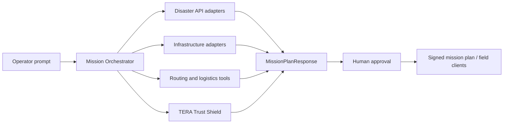

# TERA v2 Architecture

TERA v2 adds a humanitarian emergency-response layer while preserving the legacy tactical route agent.

## Legacy Mode

The original `/plan` path remains a tactical edge route agent with signed CoT verification. It is still the right path for ATAK/Jetson/Gemma demonstrations and signed render gates.

## Humanitarian Mode

`POST /mission/plan` accepts a disaster-response request and returns:

- incident summary
- hazards
- critical infrastructure
- route candidates
- route risks
- resource allocations
- Trust Shield assessments
- unverified claims
- blocked or approval-required items
- explanation
- offline fallback status

## Trust Boundary

Natural language, external links, field reports, and supply requests are data, not authority. TERA can recommend, but suspicious external claims are isolated until a human commander approves them.

## Network Behavior

The v2 mission endpoint defaults to offline fallback. Live API collection only runs when the request sets `use_live_apis=true`. Trust Shield endpoints may use live providers when API keys are present, but mission planning can call them in offline mode.
