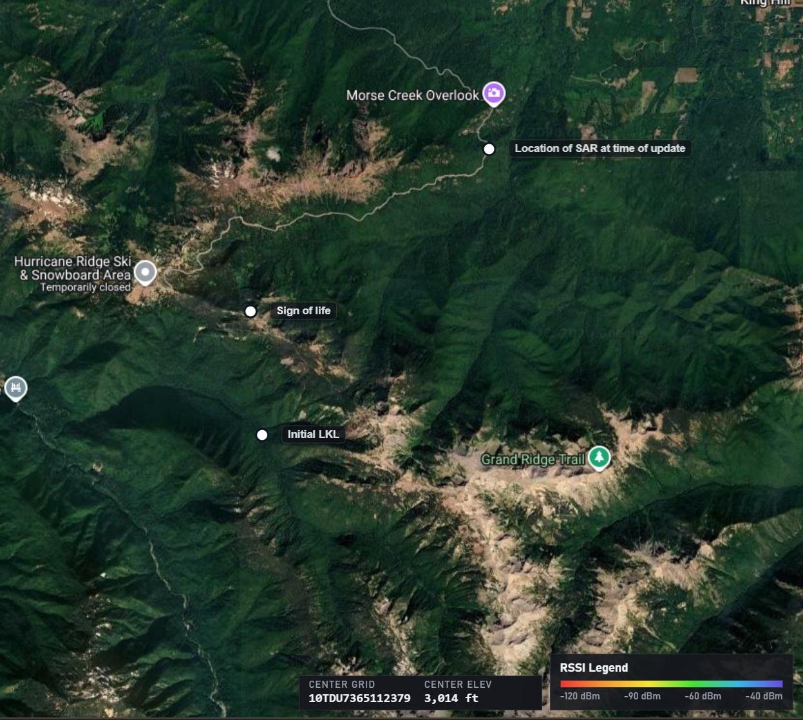

# SAR Mission — Olympic National Park (Hurricane Ridge AOI)

**Source:** Kyle, Sat 19:44 in chat
**AO:** Olympic National Park, WA — Hurricane Ridge / Morse Creek corridor
**Status:** Candidate hero scenario (third AO type — wilderness/SAR), pending Jetson AOI cache confirmation

---

## Summary

A Search-and-Rescue mission in Olympic National Park exercises TERA across the full agent loop in a wilderness AO: an intel mission planner pre-mission sources imagery and a hike-in route from a public road to the lost-hiker LKL, then expands a search-area polygon based on plausible travel radius. Mid-mission, the operator receives a mirror-flash report from a second person in distress at a different MGRS grid and asks the on-device agent to re-route from the operator's current position to the new sign-of-life. The scenario shows TERA handling MGRS in, MGRS out, and an in-mission re-plan against the same DEM + trail data — three things that compound into a credible field demo.

---

## Prompts (verbatim)

### Prompt 1 — Intel mission planner, pre-mission

> Im conducting a SAR mission IVO 10TDU6611209126 and I am looking for a lost hiker last seen at that grid location 8 hours ago. I need to hike in from the nearest public road access point and route to that location and a necessary search area based on how far the hiker could have travelled.

### Prompt 2 — In-mission re-route (operator on the ground)

> while on mission the operator gets a report of mirror signal from a person in distress IVO: 10TDU6582012396 and the operator asks the tera agent to make the best route to the sign of life while he is at: 10UDU7217316653

---

## Geography

Olympic National Park, Hurricane Ridge / Morse Creek area. Annotated waypoints from the Signal screenshot Kyle sent:

| Label | MGRS | Role |
|---|---|---|
| Initial LKL (last known location) | `10TDU6611209126` | Prompt-1 anchor — lost hiker LKL, 8h stale |
| Sign of life (mirror flash) | `10TDU6582012396` | Prompt-2 destination — re-route target |
| Operator position at update | `10UDU7217316653` | Prompt-2 origin — SAR team's current grid |
| Image center grid | `10TDU7365112379` | Screenshot center (elev. 3014 ft) |
| Morse Creek Overlook | (annotated on screenshot) | Reference terrain feature, public road access |
| Grand Ridge Trail | (annotated on screenshot) | Candidate ingress trail |

RSSI legend overlay is present in the source image and is non-load-bearing for routing — it indicates Kyle is using a mesh/comms-aware viewer for the screenshot, not that TERA must consume RSSI.

---

## Why this scenario is a great demo

The two existing PRD §6 scenarios (A — freshwater hands-free, B — covered foot route, C — vehicle route) cover urban + austere military AOs. Olympic NP adds a **wilderness/SAR third modality** that broadens the dual-use story (PRD §3.6, P-3 persona "Sam") without inventing new tooling. More importantly, it is the first scenario that exercises an **in-mission re-plan** triggered by a fresh report, which is the operator workflow that actually justifies an on-device agent — a planner-only system would force the operator to stop, re-prompt from scratch, and re-stage. Finally, both prompts hand the LLM raw MGRS strings (not lat/lon, not place names), which exercises the model's MGRS comprehension and forces a clean NL → grid → route lowering through the tool-call schema.

---

## Acceptance for demo readiness

- [ ] LLM correctly parses both MGRS grids in each prompt and emits a tool call against `/docs/contracts/agent_routing.schema.json` (no free-text geometry).
- [ ] Routing engine produces an ingress route from the nearest public road (Hurricane Ridge Rd or equivalent) to the LKL grid, using DEM + trail data, avoiding obvious cliffs.
- [ ] Search-area polygon is derived from a plausible travel radius (function of stale-time = 8h, terrain class) and rendered in ATAK as a CoT shape.
- [ ] In-mission re-route from operator grid `10UDU7217316653` to sign-of-life `10TDU6582012396` returns under the demo SLO (≤ 30s end-to-end per PRD §4 hero claim).
- [ ] ATAK renders both the initial route + search polygon and the in-mission re-route as distinct CoT entities.
- [ ] Voice-out (Piper) announces the re-route trigger and first 2-3 waypoints — this is the "operator is moving, can't look at the tablet" beat.

---

## Image

> Note: the source image was sent over Signal and lives on Jon's Mac. It is **not** retrievable from the agent transcript. Jon: drop the file at `docs/demo-scenarios/sar-olympic-screenshot.png` to populate this reference.
